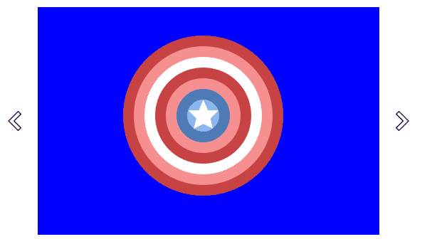

<h1 align="center">Welcome to My Amazon Card Slider 👋</h1>

heroku로 배포 : [heroku링크](https://cryptic-island-21227.herokuapp.com/)


<p>
  
  
  
  <a href="https://github.com/changicho/membership-amazon#readme">
    
  </a>
  <a href="https://github.com/changicho/membership-amazon/graphs/commit-activity">
    
  </a>
  <a href="https://github.com/changicho/membership-amazon/blob/master/LICENSE">
    
  </a>
</p>

> 캐러셀 슬라이드 컴포넌트 Compact-Slider 제작

아마존에서 사용하는 캐러셀 (이미지 슬라이드) 와 같은 컴포넌트를 제작했어요.

제작한 슬라이드 컴포넌트 *Compact-Slider*는 재사용 가능하게 구현했습니다.

### 🏠 [Homepage](https://github.com/changicho)

## 모듈 버전

- npm >=6.11.3
- node >=10.16.0

## 설치

```sh
npm install
```

## 사용법

```sh
npm run start
```

---

## Compact-Silder How to Use


먼저 compact-slider.js 스크립트 파일을 로드해주세요!

Compact-Slider는 다음과 같은 html 돔 구조를 따릅니다.

```html
<div class="compact-slider" id="user-compact-slider">
  <ul class="slides">
    <li class="slide">slide 1</li>
    <li class="slide">slide 2</li>
    <!-- insert your own slide -->
  </ul>
  <div class="button" id="prev"></div>
  <div class="button" id="next"></div>
</div>
```

위와 같은 돔 구조를 생성하시고 아래 스크립트를 실행해주세요!

```javascript
let my_compact_slider = new compact_slider("#user-compact-slider");
```

compact_slider 클래스는 인자로 querySelector의 인자와 같은 값을 받아요!

여러분이 설정한 tag, id, class 명으로 Compact-Slider 를 적용해봅시다!

## 일정 시간마다 회전하게 만들고 싶어요

> 3초마다 회전

```javascript
let my_compact_slider = new compact_slider("#user-compact-slider");
my_compact_slider.auto(3000);
```

Compact-Slider의 auto() 메소드를 사용하면 슬라이드가 자동으로 회전합니다!

인자로는 miliseconds 값을 넣어주면 됩니다.

## 자동 회전을 멈추고 싶어요

```javascript
my_compact_slider.stop();
```

Compact-Slider의 stop() 메소드를 이용하면 애니메이션을 멈출 수 있어요!

## 인디케이터로 이동하고싶어요

```javascript
let index = 2; // slide index start at 0
let my_compact_slider = new compact_slider("#user-compact-slider");
my_compact_slider.move_to(index);
```

Compact-Slider의 move_to 메소드를 사용하면 슬라이드가 자동으로 index 번째로 이동해요!

인자로는 index 값을 입력해주면 됩니다 (0번째 부터 시작하는걸 잊지마세요!)

## 이전, 다음 슬라이드로 이동할래요

```javascript
let my_compact_slider = new compact_slider("#user-compact-slider");
my_compact_slider.move_next(); // move to next slide
my_compact_slider.move_prev(); // move to previous slide
```

이전 혹은 다음 슬라이드로 움직이고 싶나요?

Compact-Slider의 move_next(), move_prev 메소드를 이용하시면 됩니다!

여러분이 버튼을 만드셔서 메소드를 호출해보세요!

## 슬라이드 이동 버튼을 만들고 싶어요

```html
<div class="compact-slider" id="user-compact-slider">
  <ul class="slides">
    <!-- insert your own slide -->
  </ul>
  <div class="button" id="prev"></div>
  <div class="button" id="next"></div>
</div>
```



DOM 구조에서 id 값을 prev, next로 설정하시면 자동적으로 버튼이 만들어집니다!

편리하죠?

---

## 만든이

👤 **Changi Cho**

- Github: [@changicho](https://github.com/changicho)

## 🤝 문제가 생겼어요!

문제가 발생하면 이 repository에 issue 탭에 남겨주시면 되요!

[issues page](git+https://github.com/changicho/membership-amazon/issues).

## 응원해주기!

이 프로젝트가 마음에 드셨다면 ⭐️ 을 눌러주세요!

금전적인 지원도 언제나 환영합니다! : 신한은행 110-412-956254 조찬기

## 📝 License

Copyright © 2019 [Changi Cho](https://github.com/changicho).<br />
This project is [MIT](https://github.com/changicho/membership-amazon/blob/master/LICENSE) licensed.

